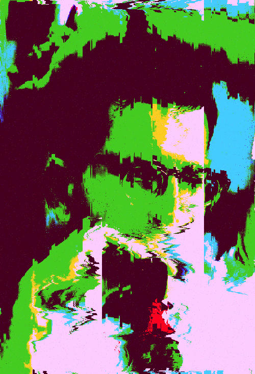
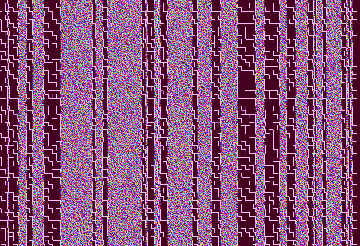
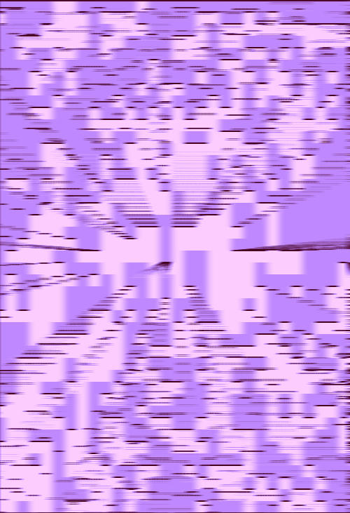
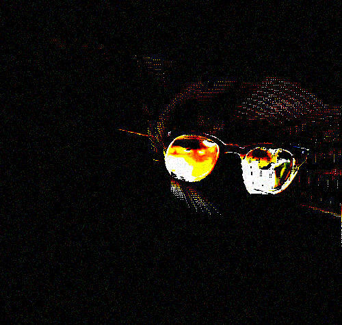

# Img-Corroder

A pipeline based image processing tool written in Rust for creating glitch effects. Also segmentate parts of the image using text prompts.

## Usage

```sh
cargo run -- -i examples/input-img.jpg -o output.jpg -c 10

cargo run -- -i examples/input-img.jpg -o output.jpg -c examples/try.json -p "glasses"
```

If you want to use the semantic segmentation, create an enviroment in the langSAM submodule and activate it:

```sh
python -m venv env
bash env/bin/activate
```

then install the dependencies:

```sh
pip install -e .
```

If any problems arise, consult the [original repo](https://github.com/luca-medeiros/lang-segment-anything).

## Command-Line Interface

The following options are available:

- `-i, --input <FILE>`: Input image file
- `-o, --output <FILE>`: Output image file
- `-c, --config <FILE>`: Pipeline configuration file
  - if a number is provided, a pipeline with a that number of effects and random parameters will be created.
- `-h, --help`: Print help information

## Custom Pipelines

Build your own effect pipeline by following the example provided in `example_fx/pipe.json`.

## Examples

<table>
  <tr>
    <td><strong>Input Image</strong></td>
    <td><strong>Output Image 1</strong></td>
    <td><strong>Output Image 2, random pipeline 10</strong></td>
    <td><strong>Output Image 3, random pipeline 10</strong></td>
    <td><strong>Segmentation with prompt "glasses", deepfry and extrusion edges</strong></td>
  </tr>
  <tr>
    <td></td>
    <td></td>
    <td></td>
    <td></td>
    <td></td>
  </tr>
</table>

## Image Filters and Parameters

Below is a list of available filters and their parameters:

- **Grayscale**
  - No parameters
  - Converts the image to grayscale

- **Invert**
  - No parameters
  - Inverts the colors of the image

- **Brightness**
  - `factor` (float, default: 1.0): Adjusts the brightness of the image

- **Sepia**
  - No parameters
  - Applies a sepia tone filter to the image

- **Contrast**
  - `factor` (float, default: 1.0): Adjusts the contrast of the image

- **Saturation**
  - `factor` (float, default: 1.0): Adjusts the color saturation of the image

- **Add Noise**
  - `intensity` (float, default: 0.1): Determines the intensity of noise added to the image

- **Deepfry**
  - `factor` (float, default: 1.0): Intensity of the deepfry effect

- **Hue Rotate**
  - `angle` (float, default: 90.0): Angle of hue rotation in degrees

- **Color Replacer**
  - `target_color` (string): The color to be replaced
  - `replacement_color` (string): The color to replace with
  - `tolerance` (integer, default: 50): Color matching tolerance

- **Vaporwave**
  - No parameters
  - Applies a vaporwave aesthetic filter to the image

- **Blur**
  - `sigma` (float, default: 2.0): Blur intensity

- **Pixelate**
  - `block_size` (integer, default: 10): Size of pixelation blocks

- **Oil Painting**
  - `radius` (integer, default: 4): Radius of the effect
  - `intensity` (integer, default: 30): Intensity of the effect

- **Glitch**
  - `amount` (integer, default: 50): Amount of glitch effect
  - `max_offset` (integer, default: 10): Maximum pixel offset
  - `direction` (string): Direction of the glitch effect
  - `noisy` (boolean, default: false): Adds noisy pixels to the glitch

- **Pixel Sort**
  - `low-threshold` (integer, default: 0): Lower threshold for pixel sorting
  - `high-threshold` (integer, default: 0): Upper threshold for pixel sorting
  - `direction` (string): Direction of pixel sorting
  - `window_size` (integer, default: 0): Size of sorting window

- **Rotate**
  - `angle` (float, default: 90): Rotation angle in degrees

- **Desync**
  - `x_shift` (integer, default: 10): Horizontal shift amount
  - `y_shift` (integer, default: 10): Vertical shift amount

- **Wind**
  - `direction` (string, default: "right"): Direction of the wind effect
  - `strength` (integer, default: 10): Strength of the wind effect

- **Scan Lines**
  - `line_thickness` (integer, default: 2): Thickness of scan lines
  - `line_spacing` (integer, default: 10): Spacing between scan lines
  - `opacity` (float, default: 0.5): Opacity of scan lines
  - `angle` (float, default: 0.0): Angle of scan lines

  - **Neon Edge**
    - `strength` (float, default: 1.0): Strength of the neon edge effect
    - `color_shift` (float, default: 0.0): Amount of color shift
    - `brightness` (float, default: 1.0): Brightness of the effect

  - **Sketch**
    - `intensity` (float, default: 10.0): Intensity of the sketch effect
    - `contrast` (float, default: 1.0): Contrast adjustment
    - `invert` (boolean, default: false): Invert the sketch colors

  - **Emboss**
    - `strength` (float, default: 100000.0): Strength of the emboss effect
    - `angle` (float, default: 45.0): Angle of the emboss effect

  - **Quantized Edge**
    - `threshold` (float, default: 80.0): Threshold for edge detection
    - `level` (integer, default: 1): Level of quantization

  - **Extrusion Edge**
    - `threshold` (float, default: 100.0): Threshold for edge detection
    - `strength` (float, default: 2.0): Strength of the extrusion effect
    - `depth` (integer, default: 15): Depth of the extrusion effect

Each filter can be applied to an image, and the parameters allow for fine-tuning of the effect. For more detailed information on each filter and its implementation, please refer to the source code.

## TODO

- png not working some fxs...
- actual corruption of jpg, png...
- ASCII filter
- SAM
  - use pyo3 better...
  - choose wheter to apply fx only there, mask the rest, mask prompt..
  - fork lang-segment-anything and add as submodule... make barebones
- depth perception
  - <https://github.com/rozgo/monodepth-rs>

## Acknowledgements

- <https://github.com/luca-medeiros/lang-segment-anything>

## References

- [PPG](https://github.com/tmick0/ppg): Applies transforms to actual decoded images, then introduces errors to the transformed data before reversing the transform to obtain an altered image. More information about the philosophy behind PPG can be found [here](https://lo.calho.st/posts/image-glitching/).
- [glitch_png](https://github.com/KernelEquinox/glitch_png)
- [Rust-Wasm-Image-Glitch](https://github.com/felixfaire/Rust-Wasm-Image-Glitch): Cool ones.

# Dithering Filter Example

You can test the new dithering filter by running the following command:

cargo run -- --input examples/input.png --output examples/dithered.png --config examples/dither.json

This applies the dithering effect with 8 quantization levels and a 4x4 dither matrix (levels: 8, size: 4).
